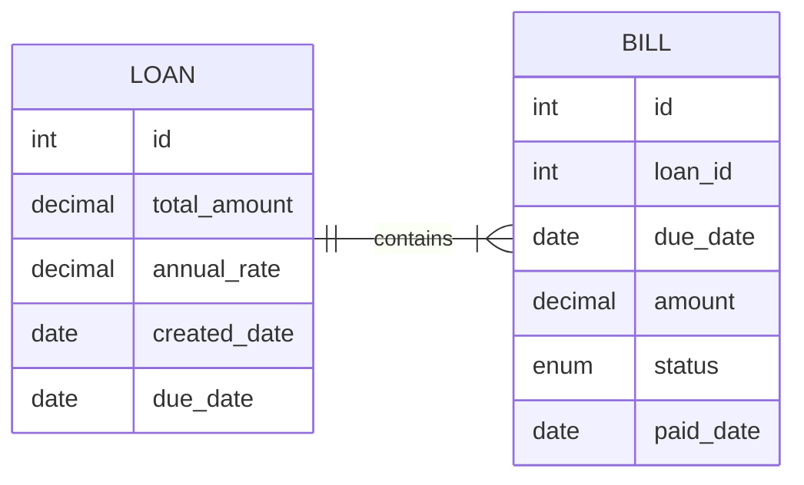

## Notes:
1. A loan is already pre-created with the following specs:
* tenure: 50 weeks
* loan amount: 5,000,000
* annual rate (fixed): 10%
2. For simplicity, we use memory (not DB) to store data


## How to use
(Make sure to install Java on your system first)
1. Build
```bash
./gradlew build
```
2. Run
```bash
java -cp build/classes/java/main com.amartha.sample.Main
```

Following screen will show up:
```bash
----
Menu
----
1. get loans
2. get bills
3. get outstanding
4. make payment
5. is delinquent

0. exit
Choose:
```
Choose a menu by typing 0-5 then press Enter
### Menu description:
1. **get loans**: get existing loans (for now, only 1)
2. **get bills**: get loan schedules for a loan
3. **get outstanding**: get the total amount of unpaid bills
4. **make payment**: pay on a specific date with exact amount based on total pending amount until that date
5. **is delinquent**: input specific date, return true if there are at least 2 unpaid bills until that date, otherwise false
